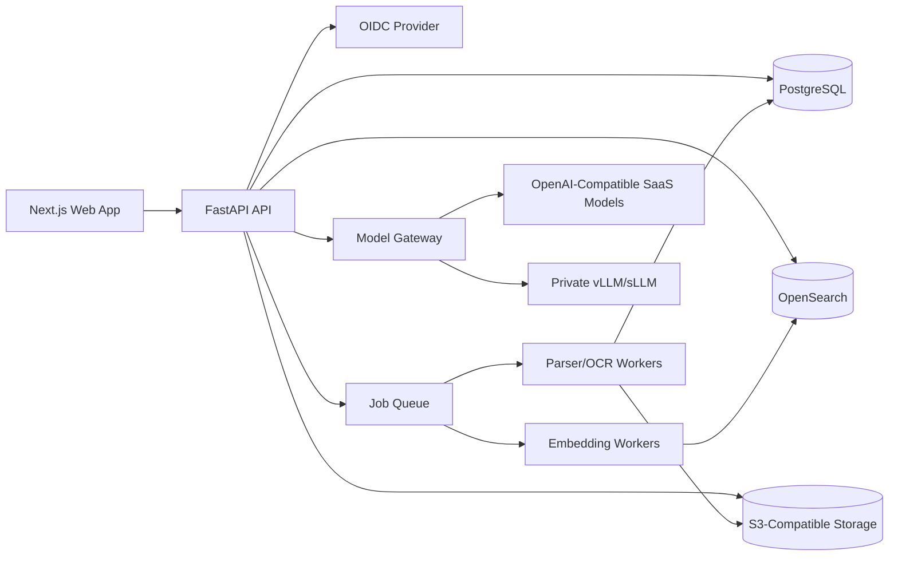
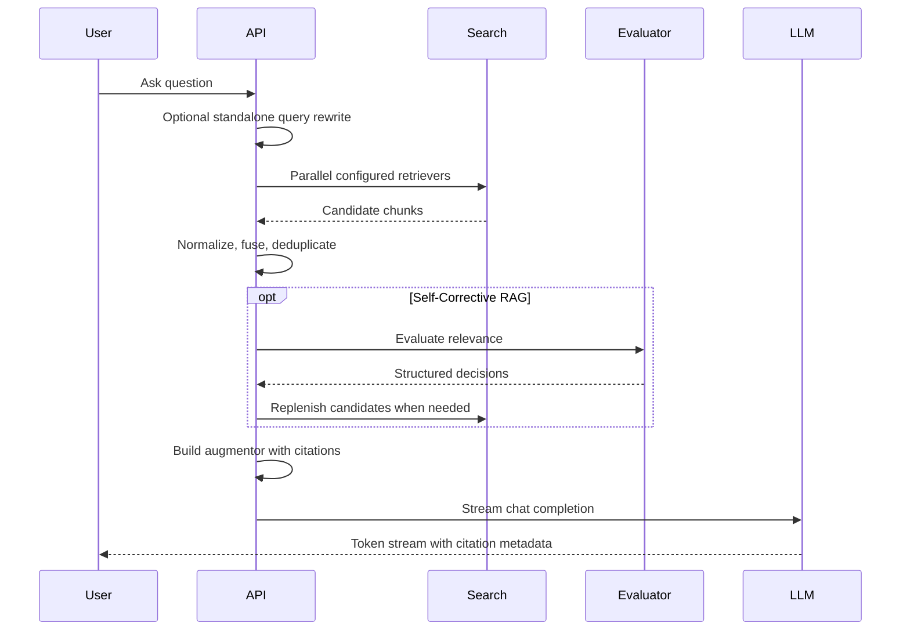

# Architecture

## System Shape

## Backend Modules

- `api`: HTTP routers and request/response schemas.
- `core`: configuration, dependency wiring, auth, logging, and telemetry.
- `domain`: entities and value objects.
- `services`: use cases for ingestion, search, RAG, models, storage, and conversations.

## Key Services

- Auth service: OIDC login, roles, and permission filtering.
- Document service: upload metadata, processing status, and source lifecycle.
- Parser service: Docling, OCR, fallback extraction, and structure preservation.
- Chunking service: section-aware chunking and source coordinate mapping.
- Embedding service: embedding model abstraction and versioning.
- Search service: BM25, vector, hybrid, multi-search, and comparison views.
- RAG service: retrieval orchestration, deduplication, corrective evaluation, augmentation, and citations.
- Model gateway: OpenAI-compatible chat and embedding clients.
- Conversation service: memory modes, standalone query rewriting, branching, and summaries.
- Artifact service: summaries, mind maps, reports, and analysis outputs.

## Data Stores

- PostgreSQL stores tenants, users, workspaces, notebooks, documents, jobs, profiles, conversations, messages, traces, and artifacts.
- OpenSearch stores chunk-level searchable documents and vector embeddings.
- S3-compatible storage stores original uploads, parsed outputs, previews, and generated artifacts.

## Retrieval Flow

## Initial Technology Choices

- Frontend: Next.js with TypeScript.
- Backend: FastAPI with Python.
- Database: PostgreSQL.
- Search: OpenSearch with k-NN/vector support.
- Storage: SeaweedFS S3 API by default, MinIO/S3 compatible later.
- Parsing: Docling first, Apache Tika fallback.
- OCR: PaddleOCR.
- Private model serving: vLLM OpenAI-compatible server.
- Deployment: Docker Compose for local, Helm for Kubernetes.

